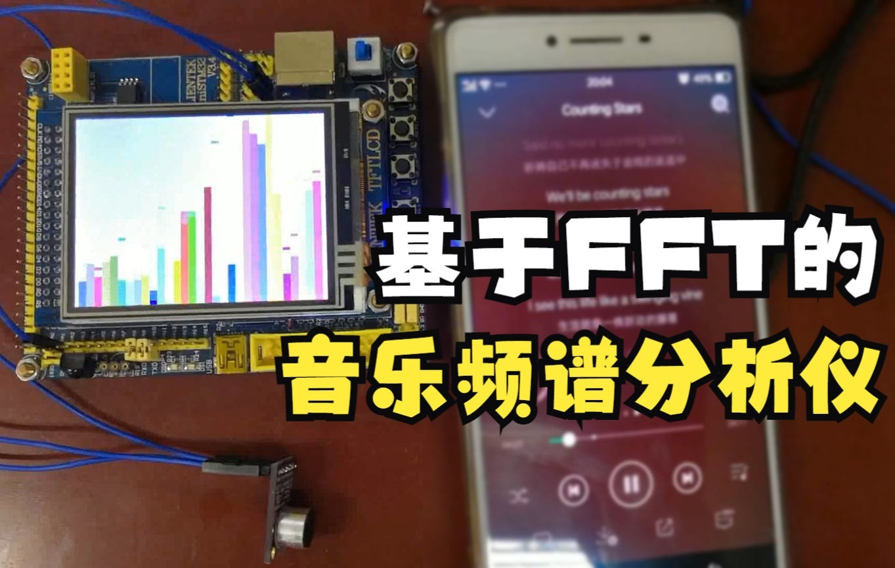

# Music_FFT_STM32
基于FFT的音乐频谱分析仪（STM32开发平台）【[视频](https://www.bilibili.com/video/BV1VU4y1u7E1/)】

  

**开发平台**：STM32F103（正点原子Mini板）

**子模块**：

+ 音频采集：MAX9814 【[技术手册](https://item.taobao.com/item.htm?spm=a1z10.3-c-s.w4002-21223910208.9.23966a4b422ZYb&id=561333542850)】
+ 模数转换：STM32自带的ADC【STM32不完全手册_第20章】
+ FFT：STM32自带的库【STM32F4开发指南_第52章 52.3 FFT测试】
+ LCD：Mini板自带的显示屏【STM32不完全手册_第16章】

**备注**：

+ 【】内为参考资料

+ STM32F103系列同样可以使用自带的FFT算法库，需要移植一下

**参考资料**：

+ 项目源码: Music_FFT_V1.1_Final
+ 项目汇报PPT
+ STM32不完全手册
+ STM32F4开发指南

百度网盘链接：https://pan.baidu.com/s/1eEPSFy0NkkLHlT2Vm52eMg 
提取码：p86q
